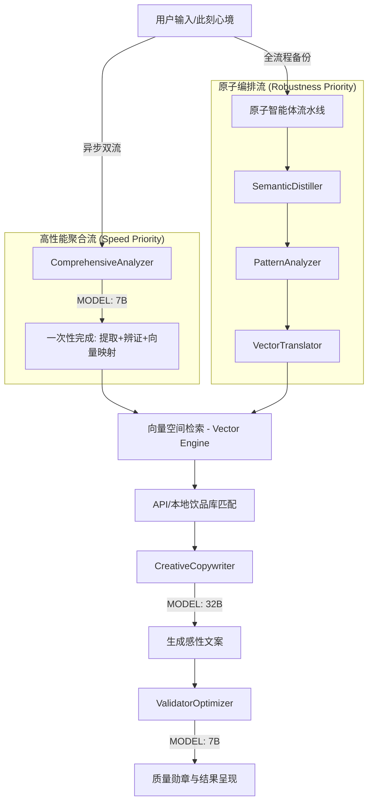
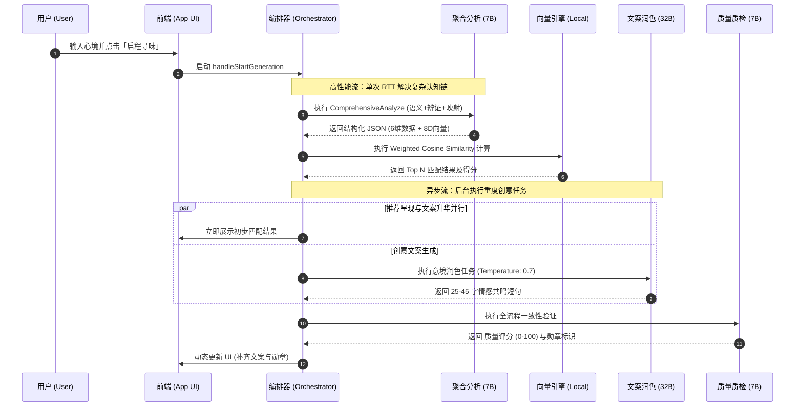

# MoodMix 项目结构与逻辑架构

## 1. 项目概述 (Overview)
**MoodMix** 是一款创新的 AI 驱动“心境饮品搭配”应用。它能够将用户输入的抽象心情描述，利用大语言模型（LLM）精准解析为结构化的味觉和体感维度数据，进而通过专门的推荐引擎运算，与酒水库（鸡尾酒或无酒精饮品）进行高维度匹配，推荐出最符合用户当下情绪的饮品。

## 2. 宏观系统架构 (System Architecture)
项目采用了**前后端分离 + 多智能体协作（Multi-Agent System）**的架构范式：

*   **前端（Frontend / Client）**：基于 React (Create React App + TailwindCSS) 构建，承担富交互、动画特效及核心算法。
*   **多智能体系统（Multi-Agent System）**：核心推荐与辅助逻辑由 6 个专职 Agent 顺序/动态协作完成。
*   **微后端（Backend Proxy）**：轻量化 Express 服务，负责大模型 API 转发、Keys 隐藏、图片资源中转（解决外部 CDN 断连问题）及容灾调度。

### 2.1 多智能体矩阵 (The Agent Matrix)

| Agent | 名称 | 角色 | 核心职责 | 驱动模型 (LLM) |
|:-----:|:-----|:-----|:---------|:---------------|
| 1 | **SemanticDistiller** | NLU传感器 | 非结构化语义识别，提取6维心境数据 | Qwen2.5-7B (Fast) |
| 2 | **PatternAnalyzer** | 辨证分析师 | 东方哲学归纳，确定调理策略（生克/纠偏） | Qwen2.5-7B (Base) |
| 3 | **VectorTranslator** | 向量翻译官 | 抽象空间映射，生成 8 维目标匹配向量 | Qwen2.5-7B (Base) |
| 4 | **CreativeCopywriter** | 创意文案师 | 基于匹配结果生成有温度的诗化推荐语 | Qwen2.5-32B (Creative) |
| 5 | **MixologyExpert** | 调饮专家 | 提供制作指导、原料替代及风味深度分析 | Qwen2.5-7B (Base) |
| 6 | **ValidatorOptimizer** | 验证优化师 | 全流程一致性验证与质量评分，确保逻辑自洽 | Qwen2.5-7B (Logical) |

### 2.2 核心逻辑流拓扑 (Logic Topology)



### 2.3 执行时序图 (Sequence Workflow)



## 3. 核心目录职能 (Directory Concerns)

```text
moodmix/
├── server/
│   └── llmProxy.js             # 【代理层】对接 LLM 接口，并承载饮品图片流式中转逻辑 (Image Proxy Shield)
├── scripts/
│   └── batchGenerate.mjs       # 【工具层】离线向量推导工具
├── src/                        # 【源码层】
│   ├── agents/                 # 多智能体核心逻辑 (specialized/)
│   ├── engine/                 # 算法引擎：向量搜索、五行映射、相似度计算
│   ├── api/                    # 外部集成：MoodAnalyzer, QuoteGenerator
│   ├── components/             # UI 原子组件与功能模态框
│   ├── store/                  # 持久化存储 (localStorageAdapter)
│   ├── data/                   # 预置知识库、翻译字典
│   └── assets/                 # 视觉资源 (图片、图标)
└── AI_EXPERIENCE.md            # 项目开发经验沉淀池
```

## 4. 关键业务流路 (Workflows)

### 4.1. 心境解析推荐流 (Detailed Agent Operations)

| 阶段 | 责任 Agent | 核心步骤 | 输入/输出数据 |
|:---|:---|:---|:---|
| **1. 语义蒸馏** | `SemanticDistiller` | 1. 文本预处理及分词<br>2. 映射至六维心境模型<br>3. 初始化 drinkMapping 基础分值 | **IN**: raw_text<br>**OUT**: 6-dim JSON |
| **2. 辨证分析** | `PatternAnalyzer` | 1. 计算六维数据间的张力与冲突点<br>2. 判定五行属性/阴阳态势<br>3. 确定“共鸣/纠偏”调息策略 | **IN**: 6-dim JSON<br>**OUT**: polarity / strategy |
| **3. 向量翻译** | `VectorTranslator` | 1. 将哲学策略转化为数学约束<br>2. 设置 8 维空间目标坐标<br>3. 动态配置维度权重 (Weights Sum=1.0) | **IN**: mood + strategy<br>**OUT**: 8D Vector |
| **4. 向量引擎** | `VectorEngine` (Local) | 1. 归一化本地饮品库数据<br>2. 执行加权余弦相似度演算<br>3. 输出相似度排名 Top 3 | **IN**: target_vector<br>**OUT**: matching_list |
| **5. 意境生成** | `CreativeCopywriter` | 1. 结合用户心境与饮品特性<br>2. 采用“三段式”感性叙事模型<br>3. 剔除古诗词干扰，追求现代口语共鸣 | **IN**: matches<br>**OUT**: quotes (25-45 chars) |
| **6. 质量质检** | `ValidatorOptimizer` | 1. 检查推荐语与心境的逻辑一致性<br>2. 评估五行生克的合规性<br>3. 生成“心味相合”等品质勋章反馈 | **IN**: full_context<br>**OUT**: score / badge |

### 4.2. 调饮辅助专家流 (Expert Support Flow)
- **动态替代方案**: `MixologyExpert` 采用“递归检索”算法，当主原料缺失时，自动在用户当前库存 (`inventory.js`) 中搜寻风味最接近的替代品，并重新计算比例。
- **自定义增强**: 为用户上传的“特调”饮品执行原子化风味还原，将其自动映射入 8 维向量空间，实现特调饮品与心境的无缝匹配。

## 5. 设计原则 (Core Design Principles)
*   **关注点分离**: Agent 独立负责认知任务，通过 `AgentContext` 互操作。
*   **低延迟体验**: 两阶段渲染策略（本地预设文案 + 异步 LLM 注入）。
*   **高可靠性**: `fetchWithRetry` 机制与 `AbortController` 协同，防止请求积压。
*   **视觉卓越**: 深度集成 TailwindCSS 与原生意境动画，营造“赛博中式”氛围。
